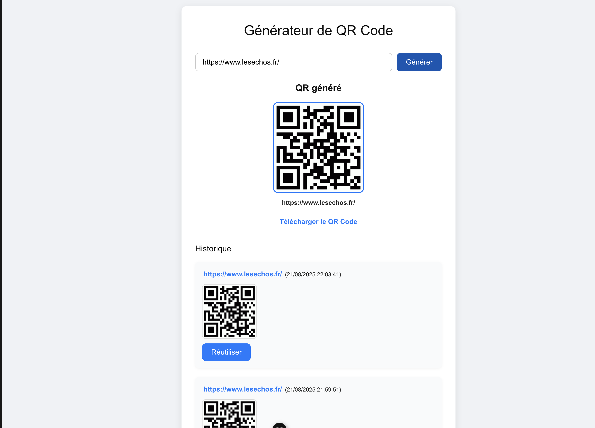

# 📱 QR Code Generator — Laravel + Vue

Une application fullstack pour générer, télécharger et garder un historique de QR Codes.
Backend en **Laravel (PHP 10)** et frontend en **Vue 3 (Vite)**.

## 🖼️ Aperçu


---

## 🚀 Installation rapide

### Backend (Laravel)
```bash
cd backend
composer install
cp .env.example .env
php artisan key:generate
👉 Configure ta base MySQL dans .env, puis :

php artisan migrate
php artisan serve
# http://127.0.0.1:8000
```

### Frontend (Vue 3 + Vite)
```bash

cd frontend
npm install
npm run dev
# http://127.0.0.1:5173
```

### 📌 API

POST /api/qrcodes → Génère et enregistre un QR code

GET /api/qrcodes → Liste l’historique des QR codes

### ⚡ Workflow dev

Lancer le backend → php artisan serve

Lancer le frontend → npm run dev

Ouvrir → http://127.0.0.1:5173
